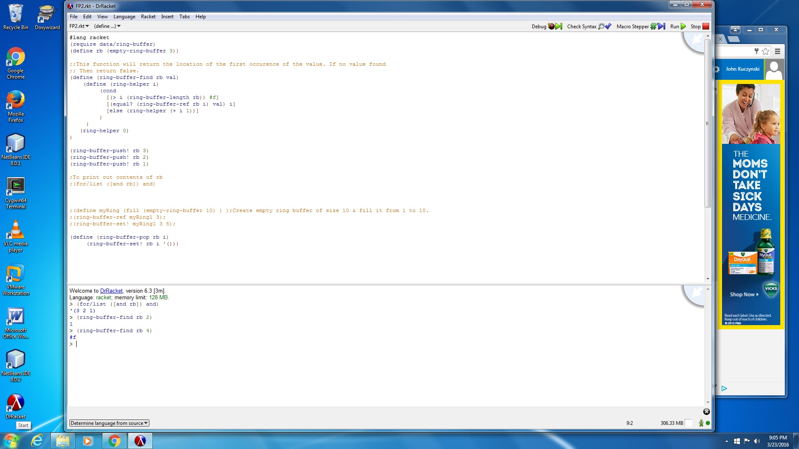
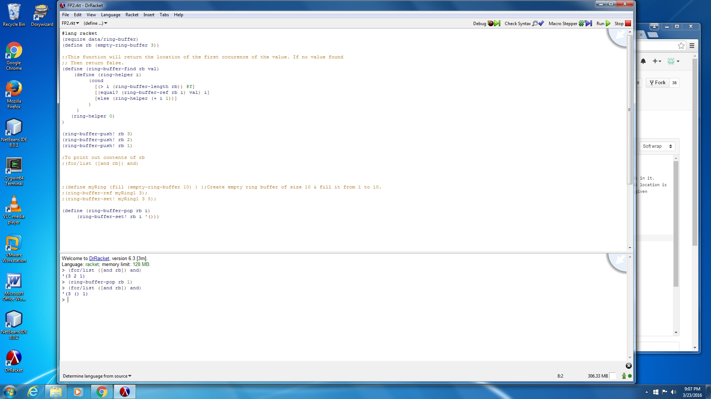

## My Library: Ring-Buffer
My name: John Kuczynski.

I installed the ring-buffer package. Then, I used the functions to create a empty ring-buffer of length 3, and put numbers in it. After that, I then created a simple function that needed to be sent a ring-buffer and a value. If the value was found, its location is returned; otherwise return false. After that, I created a function which would allow the user to remove the value at the given location, and replace it with null. 


```
(define (ring-buffer-find rb val) ;Parameters are a ring buffer and a value to search for.
    (define (ring-helper i)
         (cond
           [(> i (ring-buffer-length rb)) #f] ;If the value is not in the ring buffer, return false.
           [(equal? (ring-buffer-ref rb i) val) i] ;If found, return its location.
           [else (ring-helper (+ i 1))]
         )
     )
   (ring-helper 0)
)

```



```
(define (ring-buffer-pop rb i)
     (ring-buffer-set! rb i '()))
     ;;This function will replace the value in the designated position with null.
```

