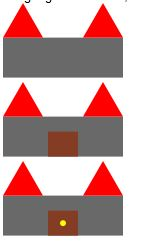

# Final Project Assignment 2: Exploration (FP2)

## My Library: (2htdp/image)
My name:Martin Rudzki

I picked 2htdp/image because it is closely related to my project. My original chosen library would have help me more with my project which was "games/gl-board-game" but was spending to much time trying to figure it out. I choose this library to be able to draw pictures for the game board and needed to make a castle looking structure.

*code*

; Above the rectangle
; Triangles beside each other
(above (overlay/offset (triangle 40 "solid" "red")
                      80 0
                      (triangle 40 "solid" "red"))
       (rectangle 120 40 "solid" "dimgray"))
The hardest part about anything for me in scheme is setting up the procedures just right. By using above your first argument will be on top what ever the second argument is. What I find interesting is that you can put multiple shapes into the first argument and comes out the way you wanted to.

From the pictures above you can see how I progressed and added new shapes. I first started off simple by drawing a rectangle, then a triangle and then my progression is as you se above. 

